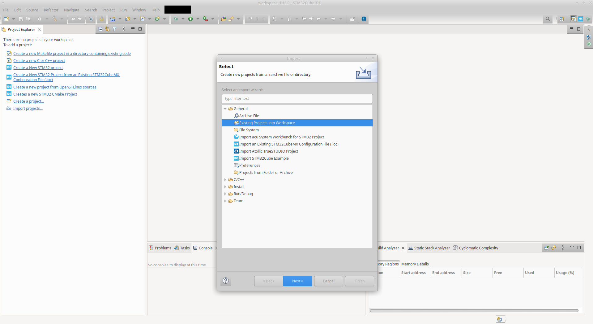
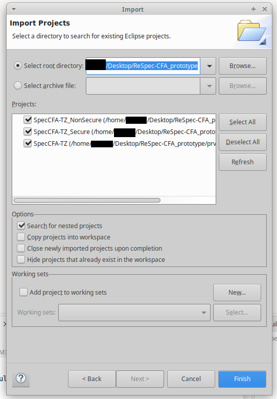
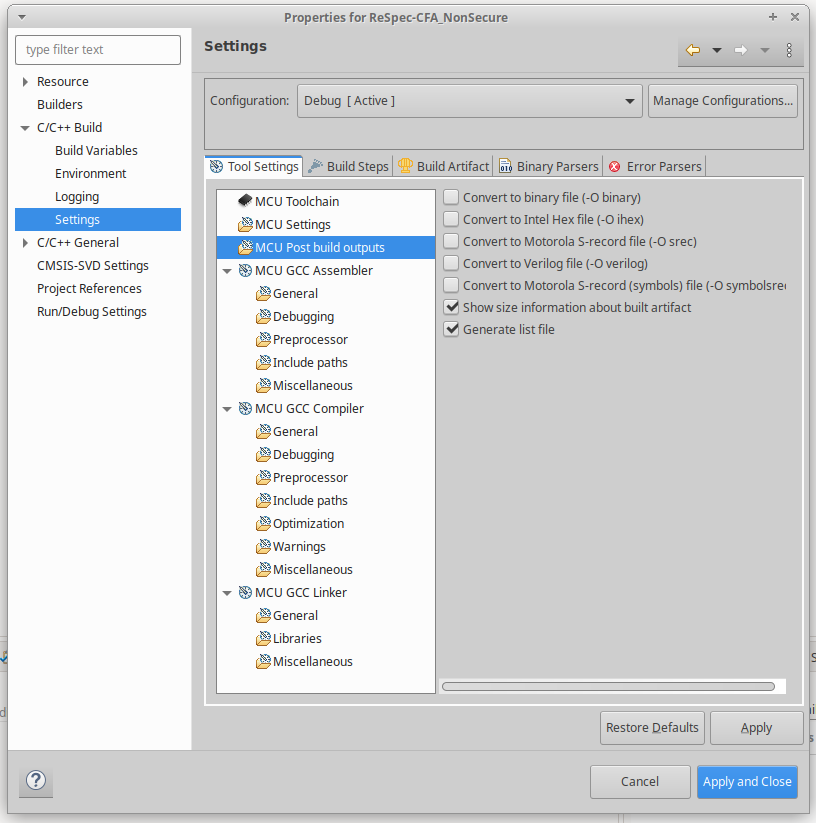
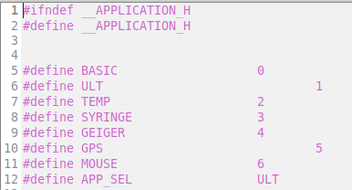
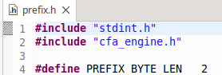
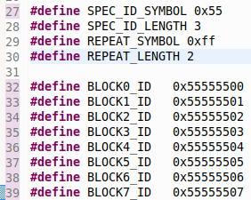
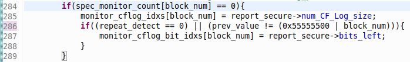
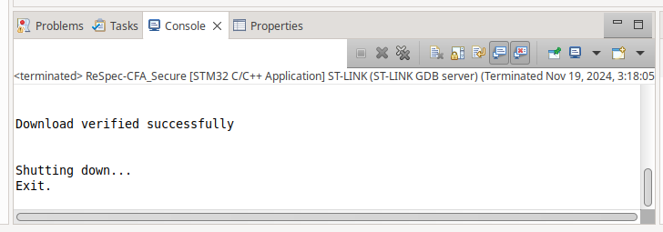
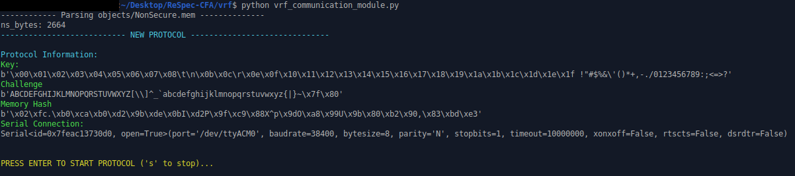
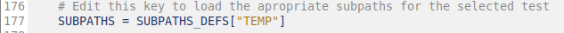

# ReSpec-CFA

ReSpec-CFA is a Control Flow Attestation (CFA) extension that enables speculative optimization of generated Control Flow logs (CFLogs) based on two new application-specific characteristics. First, ReSpec-CFA enables optimization on the localilty of branching instructions. A trusted Verifier (Vrf) can speculate on and configure a remote Prover (Prv) with a memory address prefix length. ReSpec-CFA uses this length to calculate the prefix of each control flow transfer added to CFLog and log shared prefixes only once. Second, ReSpec-CFA allows for optimizations based on Huffman codes. Vrf can generate a Huffman encoding table based on prior executions\CFLogs and send the table to Prv. ReSpec-CFA then uses this table to encode each CFLog entry at runtime. These speculation strategies achieve up to 90.1% CFLog reductions alone. However, when coupled with prior work like [SpecCFA](https://github.com/RIT-CHAOS-SEC/SpecCFA/), ReSpec-CFA achieves further reductions up to 99.7% of CFLog's original size.

A Map of ReSpec's directory structure can be found [here](#respec-directory-structure)

## ReSpec-CFA Hardware/Dependencies

ReSpec-CFA was developed and tested on an Ubuntu 20.04.2 device with a 3.7 GHz Intel Xeon W-2145 CPU.

We implement ReSpec's prototype using the STM32CubeIDE and deploy our prototype on a NUCLEO-L552ZE-Q development board featuring an STM32L552ZE MCU with support for ARM TrustZone-M. This MCU operates at 110 MHz and uses a UART-to-USB interface with a baud rate of 38400 for communication. 

**Note:** We used STM32CubeIDE 1.15.0 for our development. While other versions of the IDE should work, we experienced communication issues with the development board when using other CubeIDE versions (1.16.1 specifically). Due to this, we recommend using version 1.15.0 when running this prototype.

Using ReSpec-CFA's prototype relies on several bash and python scripts. The bash scripts require the `gcc-arm-none-eabi` toolchain to be installed. This can be done using:

    apt-get install gcc-arm-none-eabi

Or by downloading it directly from [ARM](https://developer.arm.com/downloads/-/gnu-rm). The Python scripts depend on Python's `ecdsa` package. To install this package run:

    pip install ecdsa

With the dependencies installed, you can begin setting up your project.

## Importing ReSpec-CFA's STM32 Project

To begin using ReSPec-CFA, you will need to import the project to the CubeIDE. For this:

0. Clone this repository (if you haven't already)
1. On the left side of the screen is a window labeled "Project Explorer". In this window click "import projects...". If the option is not present you can also click "File -> Import" at the top of the screen. In the resulting dialog box ensure "Existing Projects into Workspace" is highlighted and click "Next >"

2. In the next window, enter the `prv` directory. Once entered three entries should appear in the "Projects:" window. Ensure all three lines are selected and then click "Finish".

3. Once loaded a "ReSpec-CFA" folder will appear in the Project Explorer window. Expanding this folder should reveal two subfolders: "SpecCFA-TZ_NonSecure" and "SpecCFA-TZ_Secure". Right-click SpecCFA-TZ_NonSecure and select "Properties".
4. In the resulting window, select "C/C++ Build -> Settings" in the left column. In this tab select "MCU Post build outputs" and ensure that "Generate list file" is checked. Once enabled click "Apply and Close"

5. Repeat steps 3 and 4 for SpecCFA-TZ_Secure

## Selecting a Test Application

We evaluate ReSpec-CFA against 6 real-world MCU applications: a Geiger counter (geiger), GPS sensor (GPS), mouse (mouse), syringe pump (syringe), temperature sensor (temp), and an ultrasonic sensor (ultra). 

To select an application for testing open `vrf/application.h` and the edit `#define APP_SEL` statement on line 12 with the desired application. The appropriate value for each application is listed above the defines statement.

Once selected, navigate to the `vrf` directory (if not already there) and run the `pre-process.sh` exactly as follows:

    ./pre-process.sh application instrumented

This will configure the application with the necessary CFA instrumentation to the application and update the `prv` directory. The script may throw some warnings but this is fine.

Once compiled, in STM32CubeIDE right click both SpecCFA-TZ_NonSecure and SpecCFA-TZ_Secure and select "Clean Project". 

## Configuring ReSpec-CFA

ReSpec-CFA's prototype supports three speculation strategies: Prefix, Huffman, and SpecCFA's subpath speculation. By default, ReSpec-CFA is configured for the temperature sensor with all three strategies enabled and support for 8 subpaths. We provide all subpath definitions and Huffman tables used during our evaluation in the `cflogs` directory. Whether using provided test values or custom definitions, ReSpec-CFA must be reconfigured appropriately for each test.

### Enabling Speculation

To enable/disable any of the speculation strategies you must edit `prv/Secure/Core/Src/cfa_engine.c`. In this file, you will find the following on lines 468-470:

    spec = SPECCFA_process_log_entry(value, &report_secure, to_log);
	size = prefix_handler(value, &report_secure, to_log);
	size = huffman(&report_secure, to_log, size, spec);

These lines call the SpecCFA subpath, prefix, and Huffman speculation engines respectively. To enable/disable any strategy simply comment/uncomment its respective call. ReSpec-CFA is designed to work with any combination of optimizations enabled and disabling all three optimizations will result in the unoptimized CFA baseline.

### Prefix.c

The code for speculating on prefixes can be found in `prv/Secure/Core/Src/prefix.c` and `prv/Secure/Core/Inc/prefix.h`. To change the speculated prefix length simply update line 4 in `prefix.h` to the desired size.

**Note:**  ARM uses 32-bit (4-byte) addressing so the only valid settings are 1, 2, 3, and 4

### Huffman.c

The code for the Huffman speculation strategy can be found in `prv/Secure/Core/Src/huffman.c` and `prv/Secure/Core/Inc/huffman.h`. This strategy relies on a Huffman encoding table containing a Huffman code and bit length for every symbol in the symbol alphabet. The prototype represents this table as two separate arrays in `huffman.c`. The `HUFFMAN_TABLE` array (line 10) stores each symbol's encoding while the `HUFFMAN_LENGTHS` array (line 269) stores their corresponding bit length. To configure the Huffman speculation, simply replace these arrays with the correct encodings and lengths for the desired test.

As stated above, we provide all Huffman encoding tables used for our evaluation in the `cflogs` directory. This directory is divided by test application and further subdivided by speculation strategy. Each test directory where Huffman speculation was enabled contains a `huffman_encoding.txt` and a `huffman_lengths.txt` file. These files hold the Huffman codes and lengths used for the respective test. To configure the Huffman speculation submodule, simply copy the values from these files into the encoding and length arrays in `huffman.c`. For a more detailed description of the `cflogs` directory and provided test files please refer to the [cflogs Directory](#cflogs-directory) of this README.

You can also generate custom encoding tables using the provided `huffman/huffman.py` script. This script takes a directory of CFLogs and a symbol alphabet and outputs the necessary configuration files for the test. To use the script run:

    python huffman.py -d path/to/logdir -a symbol_alphabet

The script is only preloaded with two symbol alphabets: "nibble" and "byte". These correspond to single and two hex-digit values. If desired you can add custom alphabets to the script by adding it to the `alphabets.py` helper file and updating the `huffman.py`'s argparser with the new option. **However note that** as the symbols get larger the encoding table grows exponentially. By default, the resulting `huffman_encoding.txt` and ` huffman_lengths.txt` files will be output in the current directory. However, you can specify a different output directory using the `-o` command line argument. For more help on how to use the script and the available command line arguments, run:

    python huffman.py -h

### SpecCFA subpaths

The code for SpecCFA's subpath speculation is found in `prv/Secure/Core/Src/speculation.c` and `prv/Secure/Core/Inc/speculation.h`. To configure SpecCFA's subpaths simply update the subpath definitions in `speculation.c` (lines 18-68) with the desired subpaths. Similarly, you can update the `TOTAL_BLOCKS` value at line 13 to control how many subpaths are currently enabled.

Similar to the Huffman tables, the subpath definitions used to evaluate ReSpec-CFA can be found in the `cflogs/app/spec/spec.txt` file where `app` refers to the desired application's subdirectory. Further custom path definitions can be generated by running the `cflogs/path_selection.py` script. For more information on how to use `path_selection.py` please refer to SpecCFA's [opensource repository](https://github.com/RIT-CHAOS-SEC/SpecCFA?tab=readme-ov-file#cflog-analysis) or run:

    python path_selection.py -h

### GPS caveat

When running GPS with both prefix and subpath speculation enabled some logged memory addresses do naturally contain the reserved subpath symbol `11`. Thus in these tests, you must update the reserved subpath symbol to another value. We used `55` in our experiments. 

To update the symbol you will need to change the `SPEC_ID_SYMBOL` (line 27) and `BLOCKX_ID` (lines 32-39) values in `speculation.h`. You will also need to update the subpath mask on line 286 in `speculation.c`

### Building the Application

Once you have configured ReSpec-CFA, right click SpecCFA-TZ_NonSecure and SpecCFA-TZ_Secure in Project_Explorer and click "Build Project"

## Running the Application

Once built, you are ready to run the test application. To do this:

0. Ensure the development board is plugged into your device
1. Right click SpecCFA-TZ_Secure in Project Explorer and select "Run as -> STM32 C/C++ application". This will compile the application and flash it onto the MCU. This process takes a minute or two to complete.

2. Once the console window on the bottom of the CubeIDE says "Exit" and stops updating the Prv is ready. Open a terminal and navigate to the `vrf` directory.

3. Then simply run the provided `vrf_communication_module.py` script. Once launched simply press enter. This will send an attestation request to the Prv and start the attested execution. The module will also save all received CFLogs in the `cflogs` directory. 

## Verifying CFLog 

As mentioned above, all CFLogs received during the attested application are stored in the `cflogs` directory. To verify that the logs represent an expected execution run the `decoder.py` script in the `vrf` directory. This script takes both a log directory and a baseline directory, decodes the received logs, and compares the decoded log to the expected baseline. Run the script as follows:

    python decoder.py -b path/to/baseline -d path/to/logs -s -p -hf

Where `-s`, `-p`, and `-hf` indicate if the log uses subpath, prefix, and Huffman speculation respectively. In the case of subpath speculation, it is also necessary to update the attested application at line 177 in decoder.py. 

For more help on how to use the script run:

    python decoder.py -h

## cflogs Directory

All test configurations and resulting CFLogs from our evaluation of ReSpec-CFA are provided in the `cflogs` directory. Test files and results are divided into subdirectories based on their test application. Each application's subdirectory is further split by the speculation strategies enabled for the test. These configurations are as follows:

* baseline - Resulting CFLogs with no speculation strategies enabled
* combos - Tests with multiple speculation strategies enabled
  * all - Tests where SpecCFA's subpath speculation and ReSpec-CFA's prefix and Huffman speculation strategies are all enabled
  * prefix_huff - Tests where both the prefix and Huffman speculation strategies are enabled
  * spec_huff - Tests where both the SpecCFA's subpath and ReSpec-CFA's Huffman speculation strategies are enabled 
  * spec_prefix - Tests where both the SpecCFA's subpath and ReSpec-CFA's prefix speculation strategies are enabled 
* huffman - Tests where only ReSpec-CFA's Huffman speculation is enabled 
* prefix - Tests where only ReSpec-CFA's prefix speculation is enabled 
* spec - Tests where only SpecCFA's subpath speculation is enabled 

All test directories where SpecCFA is enabled (all, spec_huff, spec_prefix, and spec) are further split by how many subpaths are enabled (1-8 except ultra which has a max of 6 subpaths)

Along with the generated CFLog slices, these directories contain several test configuration files. Each application's `spec` directory contains a `specs.txt` file. This file contains the subpath definitions used in all SpecCFA-enabled tests for the application. Further, all test directories where the Huffman speculation strategy is enabled (`/huffman`. `/combos/all/*`, `/combos/prefix_huff`, and `/combos/spec_huff/*`) contain three Huffman files:

* `huffman_encoding.txt` - The Huffman codes used for the test
* `huffman_lengths.txt` - The bit lengths of the codes used in the test
* `huffman_decoding.txt` - The inverted encoding table used to decode the log

Finally, the `cflogs` directory contains a few helpful scripts.

The `cflog_size_calculator.py` script takes a directory of CFLog slices, combines them back into a single CFLog, and calculates the total size of the log in bits, bytes, and addresses (4-byte values). The script can be run as follows:
    
    python cflog_size_calculator.py -d path/to/logdir

The `get_counts.sh` bash script performs a similar operation, counting the total number of entries across all CFLog slices in the provided directory. This script can be run as follows:

    ./get_counts.sh path/to/logdir

The `huffman_table_overhead_calculator.py` script computes the memory overhead of the Huffman table for a given test. To use the script run:

    python huffman_table_overhead_calculator.py path/to/logdir

By default, this script will calculate the overhead for the Huffman table in the provided directory. However, if you supply the script with the top directory of any test application (`geiger/`, `gps/`, `mouse/`, `syringe/`, `temp/`, or `ultra/`) it will automatically compute the Huffman table overhead for all tests within the directory.

The `path_selection.py` script can be used to generate SpecCFA subpaths based on provided CFLogs. The script can be run as follows:

    python path_selection.py -d path/to/logdir selection_strategy 

This script offers several strategies and configurable criteria for subpath selection. For more information on the options available please refer to SpecCFA's [opensource repository](https://github.com/RIT-CHAOS-SEC/SpecCFA?tab=readme-ov-file#cflog-analysis) or run:

    python path_selection.py -h

### ReSpec Directory Structure

	├── cflogs
	│   ├── geiger
    │   │   ├── baseline
    │   │   ├── combos
    │   │   │   ├── all
    │   │   │   │   ├── 1
    │   │   │   │   ├── 2
    │   │   │   │   ├── 3
    │   │   │   │   ├── 4
    │   │   │   │   ├── 5
    │   │   │   │   ├── 6
    │   │   │   │   ├── 7
    │   │   │   │   └── 8
    │   │   │   ├── prefix_huff
    │   │   │   ├── spec_huff
    │   │   │   │   ├── 1
    │   │   │   │   ├── 2
    │   │   │   │   ├── 3
    │   │   │   │   ├── 4
    │   │   │   │   ├── 5
    │   │   │   │   ├── 6
    │   │   │   │   ├── 7
    │   │   │   │   └── 8
    │   │   │   └── spec_prefix
    │   │   │       ├── 1
    │   │   │       ├── 2
    │   │   │       ├── 3
    │   │   │       ├── 4
    │   │   │       ├── 5
    │   │   │       ├── 6
    │   │   │       ├── 7
    │   │   │       └── 8
    │   │   ├── huffman
    │   │   ├── prefix
    │   │   └── spec_prefix
    │   │       ├── 1
    │   │       ├── 2
    │   │       ├── 3
    │   │       ├── 4
    │   │       ├── 5
    │   │       ├── 6
    │   │       ├── 7
    │   │       └── 8
    │   ├── gps
    │   │   ├── baseline
    │   │   ├── combos
    │   │   │   ├── all
    │   │   │   │   ├── 1
    │   │   │   │   ├── 2
    │   │   │   │   ├── 3
    │   │   │   │   ├── 4
    │   │   │   │   ├── 5
    │   │   │   │   ├── 6
    │   │   │   │   ├── 7
    │   │   │   │   └── 8
    │   │   │   ├── prefix_huff
    │   │   │   ├── spec_huff
    │   │   │   │   ├── 1
    │   │   │   │   ├── 2
    │   │   │   │   ├── 3
    │   │   │   │   ├── 4
    │   │   │   │   ├── 5
    │   │   │   │   ├── 6
    │   │   │   │   ├── 7
    │   │   │   │   └── 8
    │   │   │   └── spec_prefix
    │   │   │       ├── 1
    │   │   │       ├── 2
    │   │   │       ├── 3
    │   │   │       ├── 4
    │   │   │       ├── 5
    │   │   │       ├── 6
    │   │   │       ├── 7
    │   │   │       └── 8
    │   │   ├── huffman
    │   │   ├── prefix
    │   │   └── spec_prefix
    │   │       ├── 1
    │   │       ├── 2
    │   │       ├── 3
    │   │       ├── 4
    │   │       ├── 5
    │   │       ├── 6
    │   │       ├── 7
    │   │       └── 8
    │   ├── mouse
    │   │   ├── baseline
    │   │   ├── combos
    │   │   │   ├── all
    │   │   │   │   ├── 1
    │   │   │   │   ├── 2
    │   │   │   │   ├── 3
    │   │   │   │   ├── 4
    │   │   │   │   ├── 5
    │   │   │   │   ├── 6
    │   │   │   │   ├── 7
    │   │   │   │   └── 8
    │   │   │   ├── prefix_huff
    │   │   │   ├── spec_huff
    │   │   │   │   ├── 1
    │   │   │   │   ├── 2
    │   │   │   │   ├── 3
    │   │   │   │   ├── 4
    │   │   │   │   ├── 5
    │   │   │   │   ├── 6
    │   │   │   │   ├── 7
    │   │   │   │   └── 8
    │   │   │   └── spec_prefix
    │   │   │       ├── 1
    │   │   │       ├── 2
    │   │   │       ├── 3
    │   │   │       ├── 4
    │   │   │       ├── 5
    │   │   │       ├── 6
    │   │   │       ├── 7
    │   │   │       └── 8
    │   │   ├── huffman
    │   │   ├── prefix
    │   │   └── spec_prefix
    │   │       ├── 1
    │   │       ├── 2
    │   │       ├── 3
    │   │       ├── 4
    │   │       ├── 5
    │   │       ├── 6
    │   │       ├── 7
    │   │       └── 8
    │   ├── syringe
    │   │   ├── baseline
    │   │   ├── combos
    │   │   │   ├── all
    │   │   │   │   ├── 1
    │   │   │   │   ├── 2
    │   │   │   │   ├── 3
    │   │   │   │   ├── 4
    │   │   │   │   ├── 5
    │   │   │   │   ├── 6
    │   │   │   │   ├── 7
    │   │   │   │   └── 8
    │   │   │   ├── prefix_huff
    │   │   │   ├── spec_huff
    │   │   │   │   ├── 1
    │   │   │   │   ├── 2
    │   │   │   │   ├── 3
    │   │   │   │   ├── 4
    │   │   │   │   ├── 5
    │   │   │   │   ├── 6
    │   │   │   │   ├── 7
    │   │   │   │   └── 8
    │   │   │   └── spec_prefix
    │   │   │       ├── 1
    │   │   │       ├── 2
    │   │   │       ├── 3
    │   │   │       ├── 4
    │   │   │       ├── 5
    │   │   │       ├── 6
    │   │   │       ├── 7
    │   │   │       └── 8
    │   │   ├── huffman
    │   │   ├── prefix
    │   │   └── spec_prefix
    │   │       ├── 1
    │   │       ├── 2
    │   │       ├── 3
    │   │       ├── 4
    │   │       ├── 5
    │   │       ├── 6
    │   │       ├── 7
    │   │       └── 8
    │   ├── temp
    │   │   ├── baseline
    │   │   ├── combos
    │   │   │   ├── all
    │   │   │   │   ├── 1
    │   │   │   │   ├── 2
    │   │   │   │   ├── 3
    │   │   │   │   ├── 4
    │   │   │   │   ├── 5
    │   │   │   │   ├── 6
    │   │   │   │   ├── 7
    │   │   │   │   └── 8
    │   │   │   ├── prefix_huff
    │   │   │   ├── spec_huff
    │   │   │   │   ├── 1
    │   │   │   │   ├── 2
    │   │   │   │   ├── 3
    │   │   │   │   ├── 4
    │   │   │   │   ├── 5
    │   │   │   │   ├── 6
    │   │   │   │   ├── 7
    │   │   │   │   └── 8
    │   │   │   └── spec_prefix
    │   │   │       ├── 1
    │   │   │       ├── 2
    │   │   │       ├── 3
    │   │   │       ├── 4
    │   │   │       ├── 5
    │   │   │       ├── 6
    │   │   │       ├── 7
    │   │   │       └── 8
    │   │   ├── huffman
    │   │   ├── prefix
    │   │   └── spec_prefix
    │   │       ├── 1
    │   │       ├── 2
    │   │       ├── 3
    │   │       ├── 4
    │   │       ├── 5
    │   │       ├── 6
    │   │       ├── 7
    │   │       └── 8
    │   └── ultra
    │       ├── baseline
    │       ├── combos
    │       │   ├── all
    │       │   │   ├── 1
    │       │   │   ├── 2
    │       │   │   ├── 3
    │       │   │   ├── 4
    │       │   │   ├── 5
    │       │   │   └── 6
    │       │   ├── prefix_huff
    │       │   ├── spec_huff
    │       │   │   ├── 1
    │       │   │   ├── 2
    │       │   │   ├── 3
    │       │   │   ├── 4
    │       │   │   ├── 5
    │       │   │   └── 6
    │       │   └── spec_prefix
    │       │       ├── 1
    │       │       ├── 2
    │       │       ├── 3
    │       │       ├── 4
    │       │       ├── 5
    │       │       └── 6
    │       ├── huffman
    │       ├── prefix
    │       └── spec_prefix
    │           ├── 1
    │           ├── 2
    │           ├── 3
    │           ├── 4
    │           ├── 5
    │           └── 6
	├── huffman
    ├── imgs
	├── prv
    │   ├── Drivers
    │   │   ├── CMSIS
    │   │   │   ├── Device
    │   │   │   │   └── ST
    │   │   │   │       └── STM32L5xx
    │   │   │   │           └── Include
    │   │   │   └── Include
    │   │   └── STM32L5xx_HAL_Driver
    │   │       ├── Inc
    │   │       │   └── Legacy
    │   │       └── Src
    │   ├── NonSecure
    │   │   ├── Core
    │   │   │   ├── Inc
    │   │   │   ├── Src
    │   │   │   └── Startup
    │   │   ├── Debug
    │   │   │   ├── Core
    │   │   │   │   ├── Src
    │   │   │   │   └── Startup
    │   │   │   └── Drivers
    │   │   │       └── STM32L5xx_HAL_Driver
    │   │   └── Drivers
    │   │       └── STM32L5xx_HAL_Driver
    │   ├── Secure
    │   │   ├── Core
    │   │   │   ├── Inc
    │   │   │   ├── Src
    │   │   │   └── Startup
    │   │   ├── Debug
    │   │   │   ├── Core
    │   │   │   │   ├── Src
    │   │   │   │   └── Startup
    │   │   │   └── Drivers
    │   │   │       └── STM32L5xx_HAL_Driver
    │   │   └── Drivers
    │   │       └── STM32L5xx_HAL_Driver
    │   └── Secure_nsclib
	└── vrf
	    └── objects
	
